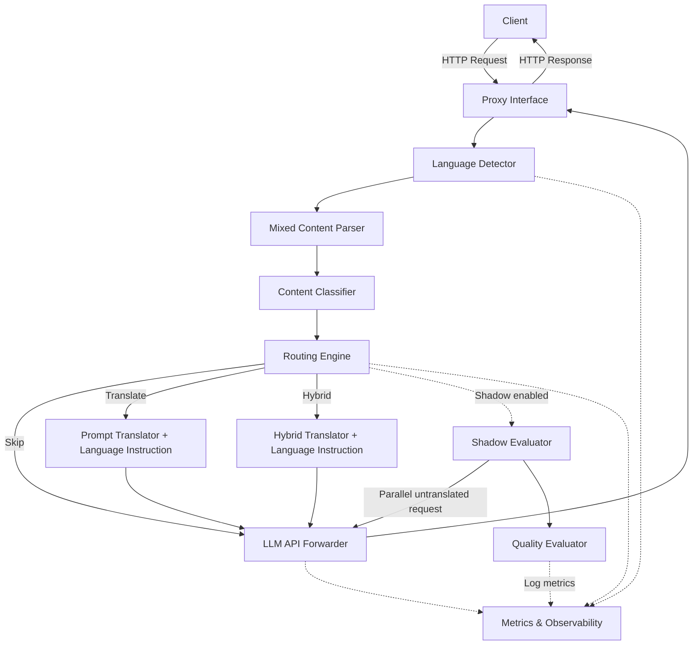

# Design Document: Multilingual Prompt Optimizer

## Overview

The Multilingual Prompt Optimizer is a middleware proxy that intercepts LLM API requests, detects the input language, classifies the task type, and selectively pre-translates prompts to an optimal language (typically English) when doing so is expected to improve LLM output quality. Rather than performing a separate response translation step, the framework appends a language instruction to the translated prompt (e.g., "Please respond in Portuguese") so the LLM produces its response directly in the user's original language. This leverages the fact that LLMs have no difficulty generating output in a specified language — the performance gap is in *understanding* non-English prompts, not in *producing* non-English responses. The system is designed as a drop-in HTTP proxy compatible with OpenAI-style chat completion APIs.

The core insight driving this system is that LLMs perform measurably worse (5-8%) on non-English inputs for many task types. By selectively translating prompts before inference and instructing the LLM to respond in the original language, we can improve output quality without requiring changes to upstream LLM APIs or downstream client code — and without the latency, cost, and error risk of a separate back-translation step.

### Key Design Decisions

1. **Language**: TypeScript/Node.js — strong async I/O, rich ecosystem for HTTP proxying, JSON handling, and NLP libraries.
2. **HTTP Framework**: Fastify — high-performance, schema validation built-in, streaming support.
3. **Language Detection**: `franc` library for lightweight BCP-47 language identification, with optional pluggable backends.
4. **Translation**: Pluggable translator interface with LibreTranslate (self-hosted, built on Argos Translate/OpenNMT) as the default backend. Supports swapping in external APIs (Google Translate, DeepL) for higher quality when needed.
5. **Configuration**: JSON/YAML files for Model Profiles and Routing Policies, loaded at startup with runtime reload support.
6. **Architecture Pattern**: Pipeline — each request flows through a sequence of stages (detect → parse → classify → route → translate + inject language instruction → forward → respond).

## Architecture

The system follows a pipeline architecture where each request passes through discrete processing stages. Each stage is a self-contained component with a well-defined interface.



### Pipeline Flow

1. **Proxy Interface** receives an OpenAI-compatible HTTP request.
2. **Language Detector** identifies the language(s) of the prompt text.
3. **Mixed Content Parser** separates translatable text from code/URLs/structured data.
4. **Content Classifier** determines the task type (reasoning, math, creative-writing, etc.).
5. **Routing Engine** evaluates routing policies against (language, task type, model profile) to decide: skip, translate, or hybrid.
6. **Prompt Translator** (if needed) translates natural language segments to the optimal language and appends a Language Instruction directing the LLM to respond in the Original_Language (e.g., "Please respond in Portuguese since the original question was asked in Portuguese").
7. **LLM API Forwarder** sends the optimized prompt (with language instruction) to the target LLM.
8. **Proxy Interface** returns the LLM response directly to the client — no back-translation needed.
9. **Shadow Evaluator** (optional) fires a parallel request with the untranslated prompt and compares quality.
10. **Metrics & Observability** logs decisions, latencies, and quality scores throughout.

## Components and Interfaces

### 1. LanguageDetector

Detects the primary and secondary languages in a text string.

```typescript
interface DetectedLanguage {
  tag: string;        // BCP-47 language tag, e.g. "en", "zh-Hans"
  confidence: number; // 0.0 to 1.0
}

interface LanguageDetectionResult {
  primary: DetectedLanguage;
  all: DetectedLanguage[];
  isUndetermined: boolean;
}

interface LanguageDetector {
  detect(text: string): LanguageDetectionResult;
  setConfidenceThreshold(threshold: number): void;
}
```

### 2. MixedContentParser

Separates a prompt into translatable and non-translatable segments.

```typescript
type SegmentType = 'text' | 'code_block' | 'inline_code' | 'url' | 'json' | 'xml' | 'yaml' | 'sql';

interface Segment {
  type: SegmentType;
  content: string;
  position: number;  // original index in the prompt
}

interface ParsedContent {
  segments: Segment[];
  translatableSegments(): Segment[];   // only 'text' segments
  nonTranslatableSegments(): Segment[];
  reassemble(translatedTexts: Map<number, string>): string;
}

interface MixedContentParser {
  parse(prompt: string): ParsedContent;
}
```

### 3. ContentClassifier

Classifies the task type of a prompt.

```typescript
type TaskCategory =
  | 'reasoning'
  | 'math'
  | 'code-generation'
  | 'creative-writing'
  | 'translation'
  | 'summarization'
  | 'culturally-specific'
  | 'general';

interface ClassificationResult {
  categories: Array<{ category: TaskCategory; confidence: number }>;
  primaryCategory: TaskCategory;
}

interface ContentClassifier {
  classify(text: string): ClassificationResult;
}
```

### 4. RoutingEngine

Decides whether and how to translate a prompt.

```typescript
type RoutingAction = 'translate' | 'skip' | 'hybrid';

interface RoutingDecision {
  action: RoutingAction;
  optimalLanguage: string | null;  // BCP-47 tag, null if skip
  matchedRule: RoutingPolicyRule | null;
  reason: string;
}

interface RoutingEngine {
  evaluate(
    detection: LanguageDetectionResult,
    classification: ClassificationResult,
    modelProfile: ModelProfile
  ): RoutingDecision;
  reloadPolicies(policies: RoutingPolicy): void;
}
```

### 5. Translator

Translates text between languages and injects language instructions. Default backend is LibreTranslate (REST API, self-hostable via Docker, built on Argos Translate/OpenNMT). The interface is pluggable to support alternative backends (DeepL, Google Translate, etc.).

```typescript
type TranslatorBackend = 'libretranslate' | 'deepl' | 'google' | 'custom';

interface TranslatorConfig {
  backend: TranslatorBackend;
  endpoint: string;           // e.g. "http://localhost:5000" for LibreTranslate
  apiKey?: string;            // required for DeepL/Google, optional for self-hosted LibreTranslate
}

interface TranslationResult {
  translatedText: string;
  sourceLanguage: string;
  targetLanguage: string;
}

interface LanguageInstructionConfig {
  template: string;           // e.g. "Please respond in {{language}} since the original question was asked in {{language}}"
  injectionMode: 'system_message' | 'append_to_last_user'; // where to inject
}

interface Translator {
  translate(text: string, from: string, to: string): Promise<TranslationResult>;
  translateBatch(texts: string[], from: string, to: string): Promise<TranslationResult[]>;
  buildLanguageInstruction(originalLanguage: string, config: LanguageInstructionConfig): string;
}
```

The default LibreTranslate implementation calls `POST /translate` with:
```json
{
  "q": "text to translate",
  "source": "pt",
  "target": "en"
}
```

### 6. LLMForwarder

Forwards requests to the target LLM API.

```typescript
interface LLMRequest {
  model: string;
  messages: Array<{ role: string; content: string }>;
  stream?: boolean;
  [key: string]: unknown; // pass-through for additional params
}

interface LLMResponse {
  raw: unknown;           // full response body from the LLM
  content: string;        // extracted text content from the response
  statusCode: number;
}

interface LLMForwarder {
  forward(request: LLMRequest, endpoint: string): Promise<LLMResponse>;
  forwardStream(request: LLMRequest, endpoint: string): AsyncIterable<unknown>;
}
```

### 7. ShadowEvaluator

Performs optional parallel shadow requests and quality comparison.

```typescript
interface QualityScore {
  coherence: number;       // 0.0 to 1.0
  completeness: number;    // 0.0 to 1.0
  factualConsistency: number; // 0.0 to 1.0
  instructionAdherence: number; // 0.0 to 1.0
  overall: number;         // weighted average
}

interface QualityComparison {
  translatedScore: QualityScore;
  baselineScore: QualityScore;
  delta: number;           // translatedScore.overall - baselineScore.overall
  translationImproved: boolean;
}

interface ShadowEvaluator {
  isEnabled(routingRule: RoutingPolicyRule | null): boolean;
  evaluate(
    originalPrompt: LLMRequest,
    translatedResponse: LLMResponse,
    forwarder: LLMForwarder,
    endpoint: string
  ): Promise<QualityComparison>;
}
```

### 8. MetricsCollector

Collects and exposes observability data.

```typescript
interface RequestLog {
  requestId: string;
  detectedLanguage: string;
  taskType: TaskCategory;
  routingDecision: RoutingAction;
  targetLanguage: string | null;
  translationLatencyMs: number;
  totalLatencyMs: number;
  qualityDelta?: number;
}

interface AggregateMetrics {
  totalRequests: number;
  translatedRequests: number;
  skippedRequests: number;
  translationErrors: number;
  avgTranslationLatencyMs: number;
  avgQualityDelta: number;
  translationImprovedPct: number;
  translationDegradedPct: number;
}

interface MetricsCollector {
  log(entry: RequestLog): void;
  getMetrics(): AggregateMetrics;
  reset(): void;
}
```

### 9. MultilingualEvaluator

Fans out a single prompt across multiple languages, collects LLM responses, and produces a per-language quality comparison report. Useful for benchmarking models, validating routing policies, and auto-populating Model_Profile performance ratings.

```typescript
interface LanguageEvaluationResult {
  language: string;           // BCP-47 tag
  response: LLMResponse;
  qualityScore: QualityScore;
  deltaFromBaseline: number;  // difference from English baseline
}

interface EvaluationReport {
  prompt: string;
  baselineLanguage: string;   // typically "en"
  baselineScore: QualityScore;
  results: LanguageEvaluationResult[];
  ranking: string[];          // languages sorted by quality, best first
}

interface MultilingualEvaluator {
  evaluate(
    prompt: string,
    targetLanguages: string[],
    modelProfile: ModelProfile,
    forwarder: LLMForwarder
  ): Promise<EvaluationReport>;
  evaluateBatch(
    prompts: string[],
    targetLanguages: string[],
    modelProfile: ModelProfile,
    forwarder: LLMForwarder
  ): Promise<EvaluationReport[]>;
}
```

### 10. ProxyServer

The HTTP server exposing the OpenAI-compatible API.

```typescript
interface ProxyServer {
  start(port: number): Promise<void>;
  stop(): Promise<void>;
}
```

## Data Models

### ModelProfile

```typescript
interface LanguagePerformance {
  languageTag: string;     // BCP-47
  performanceRating: number; // 0.0 to 1.0, relative quality
}

interface ModelProfile {
  modelId: string;
  supportedLanguages: string[];
  languagePerformance: LanguagePerformance[];
  defaultOptimalLanguage: string; // typically "en"
  endpoint: string;               // LLM API URL
}
```

Example JSON configuration:
```json
{
  "modelId": "gpt-4o",
  "supportedLanguages": ["en", "zh", "ja", "ko", "de", "fr", "es"],
  "languagePerformance": [
    { "languageTag": "en", "performanceRating": 1.0 },
    { "languageTag": "zh", "performanceRating": 0.92 },
    { "languageTag": "ja", "performanceRating": 0.88 },
    { "languageTag": "ko", "performanceRating": 0.85 }
  ],
  "defaultOptimalLanguage": "en",
  "endpoint": "https://api.openai.com/v1/chat/completions"
}
```

### RoutingPolicy

```typescript
interface RoutingPolicyRule {
  priority: number;
  matchConditions: {
    taskTypes?: TaskCategory[];       // match any listed type, or all if omitted
    sourceLanguagePattern?: string;   // regex or glob, e.g. "zh*", "ja"
    modelIdPattern?: string;          // regex or glob, e.g. "gpt-4*"
  };
  action: RoutingAction;
  targetLanguage?: string;            // override optimal language
  shadowEvaluation?: boolean;         // enable/disable shadow eval for this rule
  languageInstructionMode?: 'system_message' | 'append_to_last_user'; // where to inject the respond-in instruction
}

interface RoutingPolicy {
  rules: RoutingPolicyRule[];
}
```

Example JSON configuration:
```json
{
  "rules": [
    {
      "priority": 1,
      "matchConditions": {
        "taskTypes": ["culturally-specific"]
      },
      "action": "skip",
      "shadowEvaluation": false
    },
    {
      "priority": 2,
      "matchConditions": {
        "taskTypes": ["reasoning", "math"],
        "sourceLanguagePattern": "^(?!en).*$"
      },
      "action": "translate",
      "targetLanguage": "en",
      "shadowEvaluation": true
    },
    {
      "priority": 3,
      "matchConditions": {
        "taskTypes": ["code-generation"],
        "sourceLanguagePattern": "^(?!en).*$"
      },
      "action": "hybrid"
    }
  ]
}
```

### Request Pipeline Context

An internal object that flows through the pipeline, accumulating results from each stage:

```typescript
interface PipelineContext {
  requestId: string;
  originalRequest: LLMRequest;
  detection: LanguageDetectionResult;
  parsedContent: ParsedContent;
  classification: ClassificationResult;
  routingDecision: RoutingDecision;
  modelProfile: ModelProfile;
  translatedPrompt?: string;
  languageInstruction?: string;  // e.g. "Please respond in Portuguese"
  llmResponse?: LLMResponse;
  qualityComparison?: QualityComparison;
  timestamps: {
    received: number;
    detectionDone: number;
    parsingDone: number;
    classificationDone: number;
    routingDone: number;
    translationDone?: number;
    llmResponseReceived: number;
    completed: number;
  };
}
```

## Correctness Properties

*A property is a characteristic or behavior that should hold true across all valid executions of a system — essentially, a formal statement about what the system should do. Properties serve as the bridge between human-readable specifications and machine-verifiable correctness guarantees.*

### Property 1: Language detection output validity

*For any* prompt string, the LanguageDetector SHALL return a result where the primary language tag is a valid BCP-47 tag and the confidence score is in the range [0.0, 1.0], and all entries in the `all` array also have valid BCP-47 tags and confidence scores in [0.0, 1.0].

**Validates: Requirements 1.1**

### Property 2: Short text yields undetermined

*For any* string containing fewer than 10 characters of natural language text, the LanguageDetector SHALL return a result where `isUndetermined` is true.

**Validates: Requirements 1.4**

### Property 3: Low confidence yields undetermined

*For any* LanguageDetectionResult where all entries in the `all` array have confidence scores below the configured threshold, the result SHALL have `isUndetermined` set to true.

**Validates: Requirements 1.3**

### Property 4: Mixed content parse-reassemble round trip

*For any* prompt string, parsing it with the MixedContentParser and then reassembling the segments without any translation SHALL produce a string identical to the original prompt.

**Validates: Requirements 2.2, 2.3, 2.4**

### Property 5: Classification output validity

*For any* prompt string, the ContentClassifier SHALL return a result where every category is a member of the valid TaskCategory set and every confidence score is in the range [0.0, 1.0], and at least one category is returned.

**Validates: Requirements 3.1, 3.2**

### Property 6: Culturally-specific override

*For any* prompt where the ContentClassifier returns "culturally-specific" with confidence above 0.8, the RoutingEngine SHALL return a decision with action "skip", regardless of the Model_Profile or other routing rules.

**Validates: Requirements 3.3**

### Property 7: Same-language skip

*For any* prompt where the detected Original_Language matches the Optimal_Language for the given Model_Profile and task type, the RoutingEngine SHALL return a decision with action "skip".

**Validates: Requirements 4.1**

### Property 8: Priority-ordered rule matching

*For any* set of RoutingPolicy rules and any input (language detection, classification, model profile), the RoutingEngine SHALL return the action from the matching rule with the lowest priority number among all rules whose match conditions are satisfied.

**Validates: Requirements 4.3**

### Property 9: No-match defaults to skip

*For any* input where no RoutingPolicy rule's match conditions are satisfied, the RoutingEngine SHALL return a decision with action "skip".

**Validates: Requirements 4.4**

### Property 10: Hybrid mode translates only system messages

*For any* request processed in hybrid routing mode, system-role messages and chain-of-thought instructions SHALL be translated to the Optimal_Language, while user-role messages SHALL remain in the Original_Language.

**Validates: Requirements 4.5**

### Property 11: Placeholder preservation during translation

*For any* text containing placeholder tokens inserted by the MixedContentParser, after translation by the Translator, all original placeholder tokens SHALL still be present in the translated text.

**Validates: Requirements 5.2**

### Property 12: LLM error propagation

*For any* error response from the target LLM API, the Optimizer SHALL return a response to the caller with the same HTTP status code and error message as the original LLM error.

**Validates: Requirements 6.3**

### Property 13: Response passthrough when not translated

*For any* request where the RoutingEngine decision is "skip", the Optimizer SHALL return the LLM response without any modification to its content or structure.

**Validates: Requirements 7.3**

### Property 14: Language instruction injection

*For any* request where the RoutingEngine decision is "translate" or "hybrid", the Optimizer SHALL append a Language_Instruction to the prompt directing the LLM to respond in the Original_Language, and the instruction SHALL contain the Original_Language name.

**Validates: Requirements 7.1, 7.2**

### Property 15: ModelProfile validation

*For any* object presented as a ModelProfile configuration, the validator SHALL accept it if and only if it contains a model identifier, supported languages list, per-language performance ratings, and a default optimal language. Invalid or missing configurations SHALL be rejected with a descriptive error message.

**Validates: Requirements 8.2, 8.3**

### Property 16: Unknown model fallback

*For any* request specifying a model identifier not found in any loaded ModelProfile, the Optimizer SHALL use a default ModelProfile that routes all non-English prompts through English translation.

**Validates: Requirements 8.4**

### Property 17: RoutingPolicy validation

*For any* object presented as a RoutingPolicy rule, the validator SHALL accept it if and only if it contains a priority number, match conditions, and a valid action (translate, skip, or hybrid).

**Validates: Requirements 9.2**

### Property 18: Duplicate priority rejection

*For any* RoutingPolicy configuration containing two or more rules with the same priority number, the validator SHALL reject the configuration and report the conflicting priorities.

**Validates: Requirements 9.3**

### Property 19: Request log completeness

*For any* request processed by the Optimizer, the logged entry SHALL contain: request identifier, detected language, detected task type, routing decision, target language, total translation latency, and (when shadow evaluation was performed) translated response score, baseline response score, and score delta.

**Validates: Requirements 10.1, 11.3**

### Property 20: Aggregate metrics consistency

*For any* sequence of N processed requests, the aggregate metrics SHALL satisfy: totalRequests equals N, translatedRequests plus skippedRequests equals totalRequests, translationErrors is less than or equal to translatedRequests, avgTranslationLatencyMs equals the mean of individual translation latencies, and (when shadow evaluation data exists) avgQualityDelta equals the mean of individual score deltas, translationImprovedPct equals the percentage of requests with positive delta, and translationDegradedPct equals the percentage with negative delta.

**Validates: Requirements 10.2, 11.5**

### Property 21: Latency threshold warning

*For any* request where the round-trip translation latency exceeds the configured threshold, the Optimizer SHALL log a warning containing the request identifier and the measured latency.

**Validates: Requirements 10.3**

### Property 22: Quality score range validity

*For any* pair of LLM responses evaluated by the ShadowEvaluator, all quality scores (coherence, completeness, factualConsistency, instructionAdherence, overall) SHALL be in the range [0.0, 1.0].

**Validates: Requirements 11.2**

### Property 23: Quality degradation warning

*For any* quality comparison where the baseline response overall score exceeds the translated response overall score by more than the configured threshold, the Optimizer SHALL log a warning indicating potential quality degradation.

**Validates: Requirements 11.4**

### Property 24: Shadow disabled means no extra LLM calls

*For any* request where shadow evaluation is disabled, the Optimizer SHALL make exactly one LLM API call (the primary request) and no additional calls.

**Validates: Requirements 11.7**

### Property 25: Response structure preservation

*For any* LLM response, the Optimizer SHALL return a response to the caller with the same JSON structure as the original LLM response, with only the text content fields potentially modified by translation.

**Validates: Requirements 13.2**

### Property 26: Missing fields return 400

*For any* incoming HTTP request that is missing required fields (model, messages), the Optimizer SHALL return an HTTP 400 response with a descriptive error message.

**Validates: Requirements 13.3**

### Property 27: Evaluation report covers all requested languages

*For any* evaluation request with a prompt and N target languages, the MultilingualEvaluator SHALL return a report containing exactly N language results plus one baseline result, and the ranking array SHALL contain exactly N+1 entries.

**Validates: Requirements 12.1, 12.2, 12.3, 12.5**

### Property 28: Evaluation quality scores validity

*For any* evaluation report produced by the MultilingualEvaluator, all quality scores (per-language and baseline) SHALL have coherence, completeness, factualConsistency, instructionAdherence, and overall values in the range [0.0, 1.0], and each deltaFromBaseline SHALL equal the language's overall score minus the baseline's overall score.

**Validates: Requirements 12.4**

### Property 29: Evaluation ranking consistency

*For any* evaluation report, the ranking array SHALL be sorted in descending order of overall quality score, and the first entry SHALL be the language with the highest overall score.

**Validates: Requirements 12.5**

## Error Handling

### Translation Failures

- If the Translator fails (network error, API error, timeout), the Optimizer falls back to forwarding the original untranslated prompt to the LLM (without language instruction). A warning is logged with the request ID and error details.

### LLM API Errors

- All error responses from the target LLM are propagated to the caller with the original HTTP status code and error body intact. The Optimizer does not mask or transform LLM errors.

### Configuration Errors

- Invalid ModelProfile or RoutingPolicy configurations are rejected at load time with descriptive error messages. The service will not start with invalid configurations.
- Duplicate priority numbers in RoutingPolicy rules cause rejection of the entire policy file.
- Missing model profiles for a requested model ID trigger fallback to the default profile (translate non-English to English).

### Language Detection Failures

- If the LanguageDetector cannot determine the language (confidence below threshold or text too short), the prompt is marked "undetermined" and passed through without translation.

### Request Validation Errors

- Malformed or incomplete HTTP requests (missing `model` or `messages` fields) receive an HTTP 400 response with a descriptive error message.

### Shadow Evaluation Failures

- If the shadow evaluation LLM call fails, the primary response is still returned to the caller. The shadow failure is logged as a warning but does not affect the primary request path.

### Timeout Handling

- Each pipeline stage has a configurable timeout. If any stage exceeds its timeout, the system falls back to the most recent valid state (e.g., untranslated prompt) and continues processing.

## Testing Strategy

### Property-Based Testing

The project will use **fast-check** (TypeScript property-based testing library) for all correctness properties defined above.

Each property test:
- Runs a minimum of 100 iterations with randomly generated inputs
- Is tagged with a comment referencing the design property: `// Feature: multilingual-prompt-optimizer, Property N: <title>`
- Each correctness property is implemented by a single property-based test

Key property tests by component:

**LanguageDetector**:
- Property 1: Output validity (BCP-47 tags, confidence range)
- Property 2: Short text → undetermined
- Property 3: Low confidence → undetermined

**MixedContentParser**:
- Property 4: Parse-reassemble round trip (critical — this is the core data integrity guarantee)

**ContentClassifier**:
- Property 5: Output validity (valid categories, confidence range)

**RoutingEngine**:
- Property 6: Culturally-specific override
- Property 7: Same-language skip
- Property 8: Priority-ordered rule matching
- Property 9: No-match defaults to skip
- Property 10: Hybrid mode message targeting

**Translator**:
- Property 11: Placeholder preservation

**LLMForwarder / Proxy**:
- Property 12: Error propagation
- Property 13: Response passthrough
- Property 25: Response structure preservation
- Property 26: Missing fields → 400

**Configuration Validation**:
- Property 15: ModelProfile validation
- Property 16: Unknown model fallback
- Property 17: RoutingPolicy validation
- Property 18: Duplicate priority rejection

**Metrics & Observability**:
- Property 19: Log completeness
- Property 20: Aggregate metrics consistency
- Property 21: Latency threshold warning

**Shadow Evaluation**:
- Property 22: Quality score range validity
- Property 23: Quality degradation warning
- Property 24: Shadow disabled → no extra calls

**Language Instruction**:
- Property 14: Language instruction injection

**Multilingual Evaluator**:
- Property 27: Report covers all requested languages
- Property 28: Quality scores validity
- Property 29: Ranking consistency

### Unit / Example Tests

Unit tests complement property tests for specific scenarios and edge cases:

- Multi-language detection with known multilingual inputs (Req 1.2)
- Translation failure fallback with mocked translator (Req 5.3)
- LLM API forwarding with mock endpoints (Req 6.1, 6.2)
- Language instruction injection with various languages and templates (Req 7.1, 7.2, 7.4)
- Config file loading from JSON and YAML (Req 8.1, 9.1)
- Runtime policy reload (Req 9.4)
- Shadow evaluation enable/disable per rule (Req 11.1, 11.6)
- OpenAI-compatible request/response format (Req 13.1)
- Streaming vs synchronous response modes (Req 13.4)
- Multilingual evaluation with 3+ languages and quality ranking (Req 12.1, 12.5)
- Batch evaluation with multiple prompts (Req 12.6)
- Auto-update of Model_Profile from evaluation results (Req 12.7)

### Integration Tests

End-to-end tests with a mock LLM backend:

- Full pipeline: non-English prompt → detect → parse → classify → route → translate + language instruction → forward → respond
- Full pipeline: English prompt → detect → route (skip) → forward → respond (no translation, no instruction)
- Hybrid mode: mixed system/user messages with selective translation
- Shadow evaluation: parallel request and quality comparison logging
- Error scenarios: LLM errors, translation failures, invalid configs
- Multilingual evaluation: fan-out across 5 languages, verify per-language quality scores and ranking

### Test Configuration

```typescript
// fast-check configuration
const FC_CONFIG = {
  numRuns: 100,       // minimum iterations per property
  verbose: true,
  endOnFailure: true,
};
```

## Integration Patterns

### OpenClaw Agent Framework

[OpenClaw](https://github.com/openclaw) is an open-source autonomous AI agent framework that connects LLMs to tools and messaging channels (WhatsApp, Telegram, Discord, etc.) via a Gateway. The Multilingual Prompt Optimizer integrates naturally with OpenClaw in two ways:

#### Pattern 1: Transparent Proxy (recommended)

OpenClaw's Gateway makes OpenAI-compatible LLM API calls. Point OpenClaw's LLM endpoint configuration at the Optimizer proxy instead of directly at the LLM API. The proxy translates the prompt, appends the language instruction, forwards to the actual LLM, and returns the response. OpenClaw requires zero code changes.

```
User (Portuguese) → WhatsApp → OpenClaw Gateway → Optimizer Proxy → LLM API
                                                    ↓
                                              1. Detect language (pt)
                                              2. Translate prompt to English
                                              3. Append "respond in Portuguese"
                                              4. Forward to LLM
                                              5. Return response in Portuguese
```

Configuration example (OpenClaw Gateway LLM config):
```yaml
# Instead of pointing directly to OpenAI:
# endpoint: https://api.openai.com/v1/chat/completions
# Point to the Optimizer proxy:
endpoint: http://localhost:3000/v1/chat/completions
```

#### Pattern 2: OpenClaw Skill/Tool

Package the Optimizer as an installable OpenClaw skill that the agent can invoke selectively when handling multilingual content. This gives the agent explicit control over when translation optimization is applied, useful when only some conversations are multilingual.

#### Use Case

An OpenClaw agent deployed on WhatsApp for a Brazilian company. Users message in Portuguese, the agent receives the message, the proxy transparently translates the prompt to English for better LLM comprehension, appends a language instruction to respond in Portuguese, and the LLM produces a higher-quality response — all without any changes to the OpenClaw agent or the user experience.

## Distribution and Deployment

### Distribution Options

#### 1. npm Package + Docker Compose (recommended)

The primary distribution method. The proxy is published as an npm package for direct use, and a `docker-compose.yml` bundles the proxy with LibreTranslate for a zero-config experience.

npm usage:
```bash
npm install -g multilingual-prompt-optimizer
mpo start --config ./config.yaml
```

Docker Compose usage (proxy + LibreTranslate in one command):
```yaml
# docker-compose.yml
services:
  optimizer:
    build: .
    ports:
      - "3000:3000"
    depends_on:
      - libretranslate
    environment:
      - TRANSLATOR_ENDPOINT=http://libretranslate:5000
      - CONFIG_PATH=/app/config
    volumes:
      - ./config:/app/config

  libretranslate:
    image: libretranslate/libretranslate:latest
    ports:
      - "5000:5000"
```

```bash
docker compose up -d
# Proxy available at http://localhost:3000/v1/chat/completions
# LibreTranslate available at http://localhost:5000
```

#### 2. Standalone Docker Image

Single image with the proxy only, for users who already have a translation backend or want to use DeepL/Google.

```bash
docker run -p 3000:3000 \
  -e TRANSLATOR_BACKEND=deepl \
  -e DEEPL_API_KEY=your-key \
  -v ./config:/app/config \
  multilingual-prompt-optimizer
```

#### 3. npm Package Only

For programmatic integration or users who want full control over the setup.

```typescript
import { createOptimizer } from 'multilingual-prompt-optimizer';

const optimizer = createOptimizer({
  translator: { backend: 'libretranslate', endpoint: 'http://localhost:5000' },
  configPath: './config',
});

await optimizer.start(3000);
```

### Configuration Files

The config directory contains:
```
config/
├── model-profiles.yaml    # Per-model multilingual capability profiles
├── routing-policies.yaml  # Routing rules (priority, conditions, actions)
└── optimizer.yaml         # Global settings (thresholds, templates, shadow eval)
```

### Quick Start

```bash
# Clone and run with Docker Compose (includes LibreTranslate)
git clone https://github.com/your-org/multilingual-prompt-optimizer
cd multilingual-prompt-optimizer
docker compose up -d

# Point your LLM client at the proxy
export OPENAI_BASE_URL=http://localhost:3000/v1
```

Any existing OpenAI-compatible client (OpenClaw, LangChain, direct API calls) works by changing the base URL to point at the proxy.
